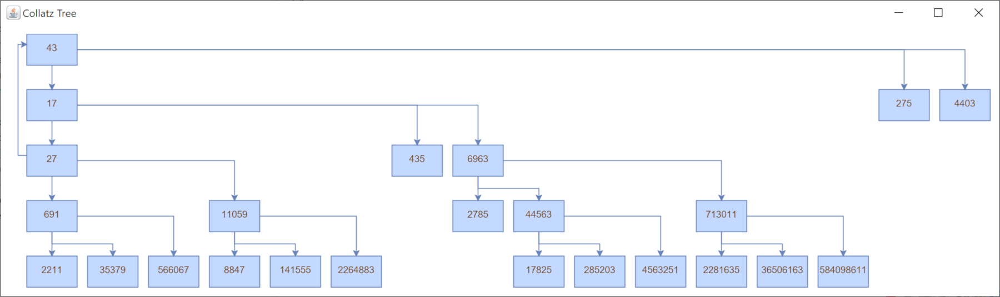
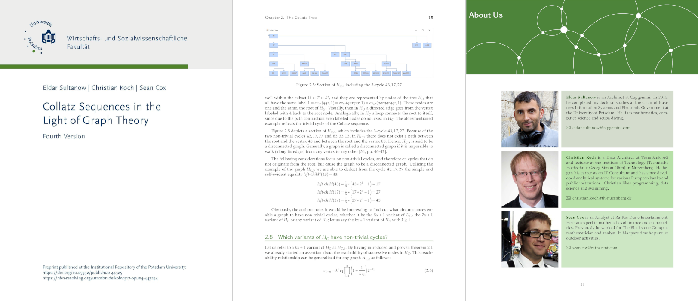

# A Java Tool for Visualizing Collatz Trees

We develop a tool that facilitates understanding the Collatz tree.

Visualizations created with our tool are used in our manuscript "Collatz Sequences in the Light of Graph Theory":
https://doi.org/10.25932/publishup-44325

